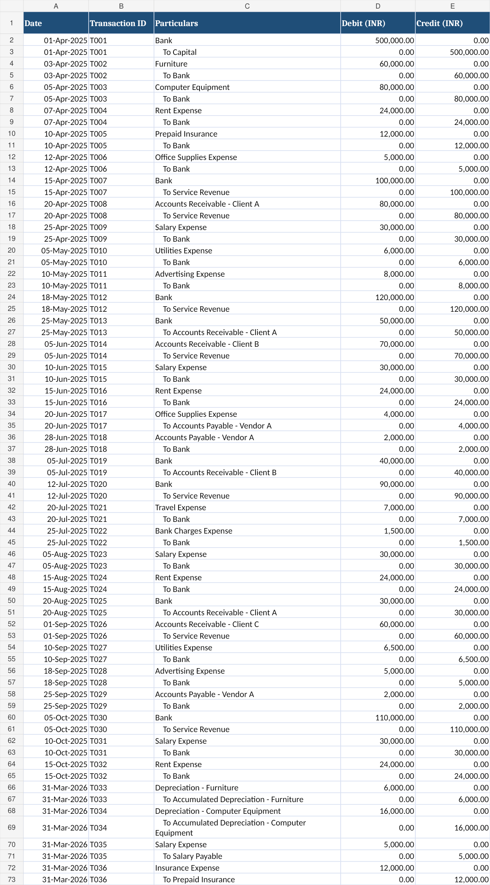
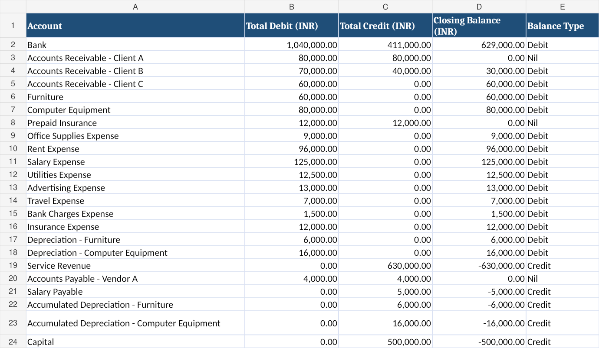
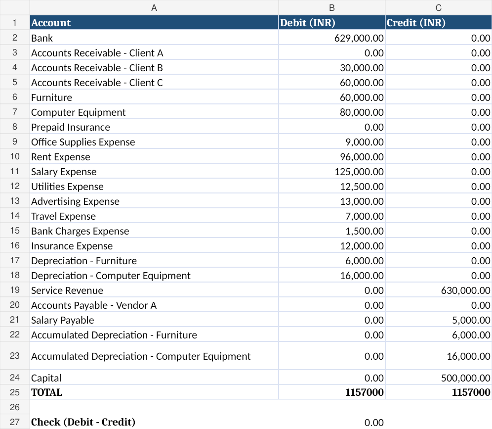
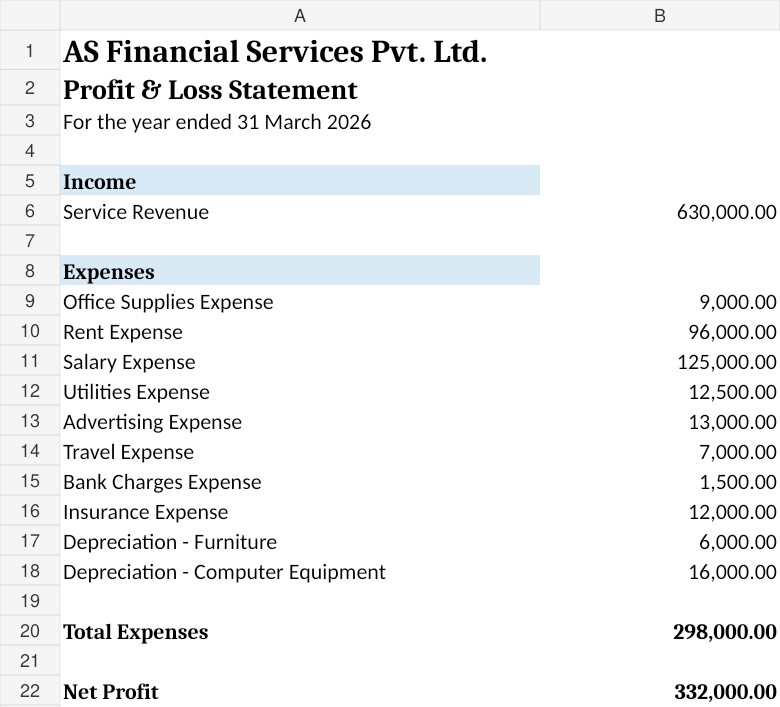
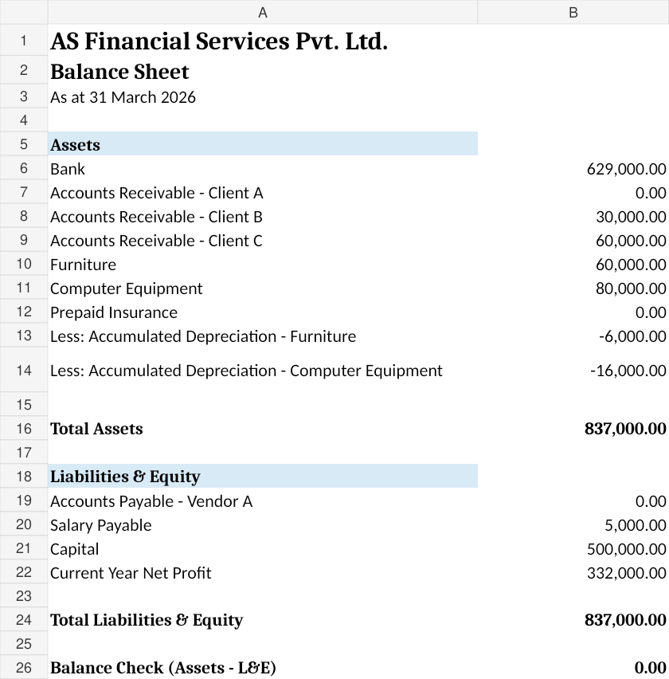

# Complete Accounting Cycle – AS Financial Services Pvt. Ltd.

## Project Overview
This project demonstrates a complete accounting cycle for AS Financial Services Pvt. Ltd., a simulated company created for educational and professional portfolio purposes.

The project covers the complete accounting process from recording business transactions to preparing financial statements using Microsoft Excel.

## Company Details
- Company: AS Financial Services Pvt. Ltd.
- Financial Year: 1 April 2025 – 31 March 2026
- Currency: INR
- Nature of Project: Simulated Accounting Project

## Tools Used
- Microsoft Excel
- Financial Accounting
- Bookkeeping
- Financial Statement Preparation

## Project Modules
1. Company Profile
2. Transactions
3. Journal Entries
4. Ledger
5. Trial Balance
6. Profit & Loss Account
7. Balance Sheet

## Key Skills Demonstrated
- Journal Entry Recording
- Ledger Posting
- Trial Balance Preparation
- Profit & Loss Preparation
- Balance Sheet Preparation
- Excel-based Accounting
- Accounting Reconciliation and Checking

## Project Screenshots

### Journal Entries

### Ledger

### Trial Balance

### Profit & Loss

### Balance Sheet

## Project Outcome
The workbook demonstrates the flow of accounting information from source transactions through journal and ledger records to the final financial statements.

## Disclaimer
AS Financial Services Pvt. Ltd. is a simulated company created for educational and professional portfolio purposes. All transactions and financial figures used in this project are fictional.
